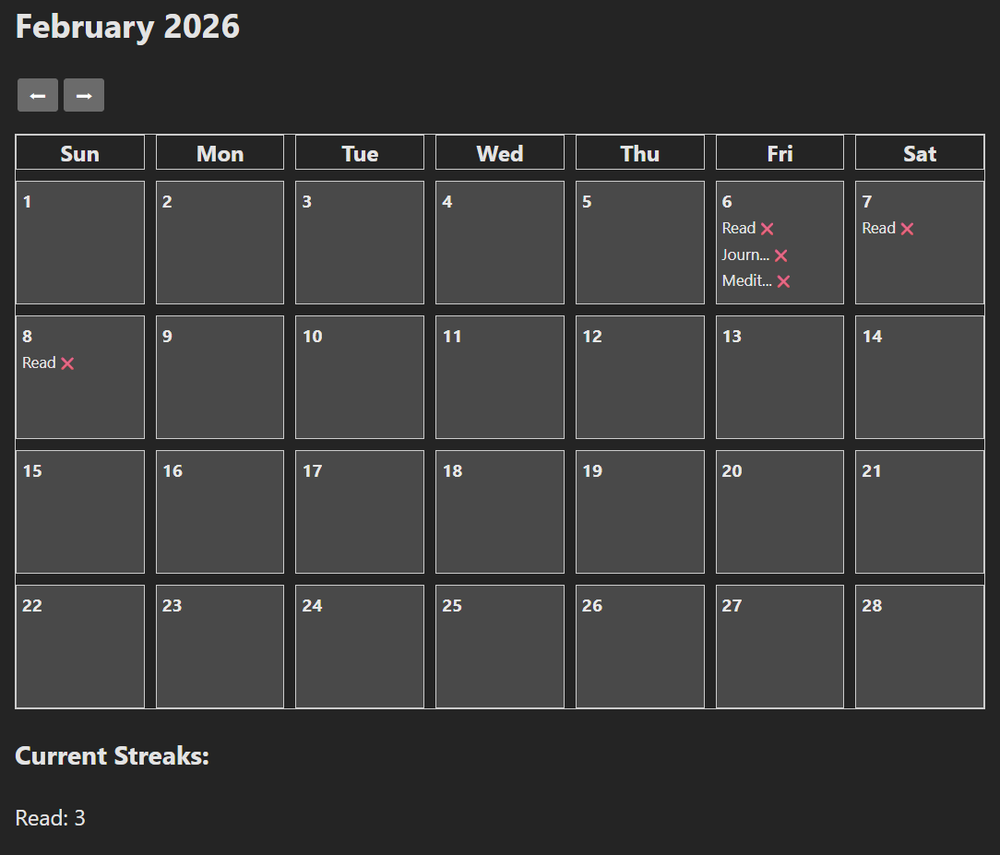

This is a simple, single-user app with a Flask backend and a React frontend. 

Run backend from root with 'python -m backend.app' 
Run frontend from /frontend with 'npm run dev' 

Author: Chris Becker 
chrisbecker1206@gmail.com 

